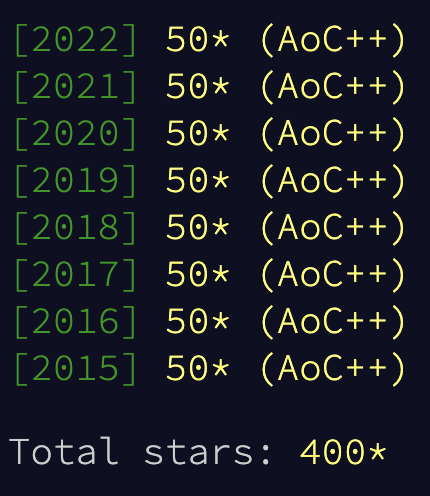

[reddit thread after completing the first six years](https://www.reddit.com/r/adventofcode/comments/klzgnx/complete_repo_and_thoughts_in_comments/)

[reddit thread post 2021](https://www.reddit.com/r/adventofcode/comments/rrog0y/all_caught_up_repo_all_gogolang_thoughts_in/)

### Quick Note
I started this in a pre-generics Go/Golang world. Maybe one day I'll come back and learn generics as they'd be quite useful here. But that's for future Alex.

## Running Locally
### Requirements
Go 1.16+ is required because [embed][embed] is used for input files.

Use `go run main.go -part <1 or 2>` will be usable to run the actual inputs for that day.

Use `go test -run RegExpToMatchFunctionNames .` to run examples and unit tests via the `main_test.go` files.

## Scripts (used for all years but 2019)
Makefile should be fairly self-documenting. Alternatively you can run the binaries yourself via `go run` or `go build`.

`make help` prints a help message.

### Make skeleton files
```sh
for ((i=1; i<26; i++)); do
make skeleton DAY=$i YEAR=2021
done
```

Note that skeletons use [embed][embed] and __will not compile__ without an `input.txt` file located in the same folder. Input files can be made via `make input`.
```sh
make skeleton DAY=5 YEAR=2020
make input DAY=5 YEAR=2020 AOC_SESSION_COOKIE=your_cookie
```

### Fetch inputs and write to input.txt files
Requires passing your cookie from AOC from either `-cookie` flag, or `AOC_SESSION_COOKIE` env variable.
```sh
make input DAY=1 YEAR=2020
```

[embed]: https://golang.org/pkg/embed/
